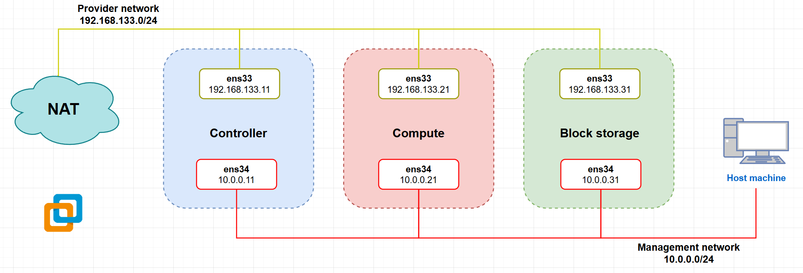

# OpenStack Automation Script

This repository contains a set of scripts to automate the installation and configuration of OpenStack on a multi-node setup with one Controller node, one Compute node, and one Storage node. These scripts are intended for educational and experimental purposes, particularly in a cybersecurity lab environment.

Working with OpenStack 2024.1 and Ubuntu 22.04 LTS

## Requirements

- **Operating System**: Ubuntu server 22.04
- **Virtualization Software**: Oracle VirtualBox (or another compatible hypervisor)

## Network Topology



Read more [here](https://docs.openstack.org/install-guide/environment-networking.html).

## Installation

### 1. **Clone the Repository**

```bash
git clone https://github.com/phannhat17/openstack-script.git
cd openstack-script
find . -type f -exec chmod +x {} \;
cd scripts
```

### 2. **Prepare the Environment**

Ensure each node (Controller, Compute, Storage) is up and accessible as **root** within your network. Also, ensure that IPs are set correctly in the configuration files.

The Storage Node needs to have atleast two disks connected. And if this Node use LVM on the OS disk, read more [here](https://docs.openstack.org/cinder/2024.1/install/cinder-storage-install-ubuntu.html)

### 3. **Run the IP config Script**

On each node (Controller, Compute, Storage), run the IP config script:

**Note: Run this inside the `scripts` folder**

```bash
./config_ip.sh
```

The script will prompt you to select which node (Controller, Compute, or Storage) you are configuring. It will then update the network settings adn reboot that node.

### 4. **Run the Service install Script**

On each node (Controller, Compute, Storage), run the service install script:

**Note: Run this inside the `scripts` folder**

```bash
./install_service.sh
```

The script will prompt you to select which node (Controller, Compute, or Storage) you are configuring.

## License

This project is licensed under the MIT License. See the [LICENSE](LICENSE) file for details.